# DIY Accounting Submit - AWS Architecture

**Version**: 2.0
**Date**: January 2026
**Status**: Production

---

## Executive Summary

DIY Accounting Submit is a serverless web application enabling UK businesses to submit VAT returns directly to HMRC via the Making Tax Digital (MTD) API. The architecture leverages AWS services for scalability, security, and cost-efficiency.

**Key Characteristics:**
- Fully serverless (no EC2 instances)
- Multi-account AWS Organization for security isolation
- Infrastructure as Code (AWS CDK)
- CI/CD via GitHub Actions with OIDC authentication

---

## 1. Multi-Account Structure

### 1.1 Account Overview

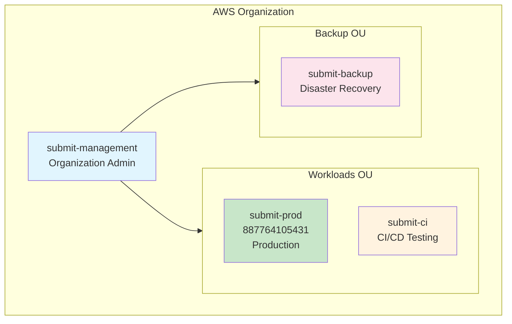

### 1.2 Account Responsibilities

| Account | ID | Purpose | Contains |
|---------|-----|---------|----------|
| **submit-management** | (new) | Organization administration | IAM Identity Center, Organizations, Consolidated Billing |
| **submit-prod** | 887764105431 | Production workloads | All application resources, live user data |
| **submit-ci** | (new) | CI/CD testing | Identical stack with test data, HMRC sandbox |
| **submit-backup** | (new) | Backup isolation | Cross-account backup vault only |

### 1.3 Security Rationale

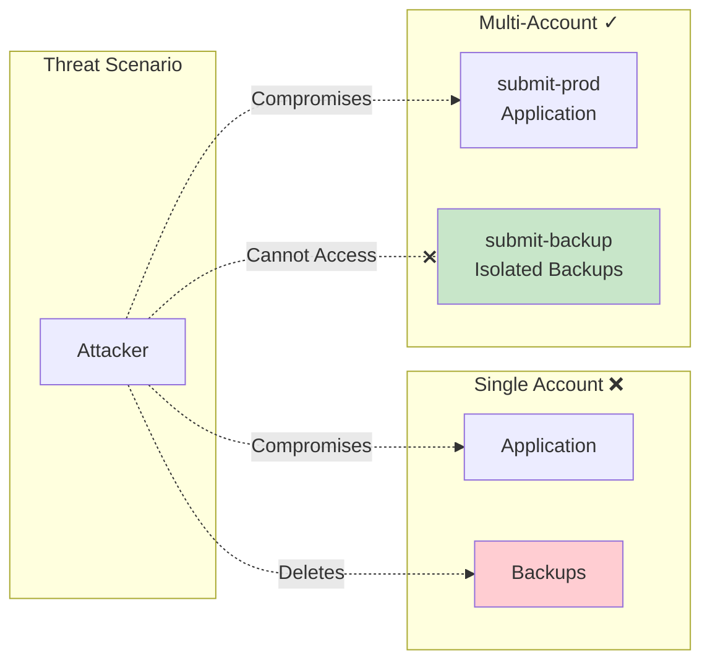

---

## 2. Application Architecture

### 2.1 High-Level Overview

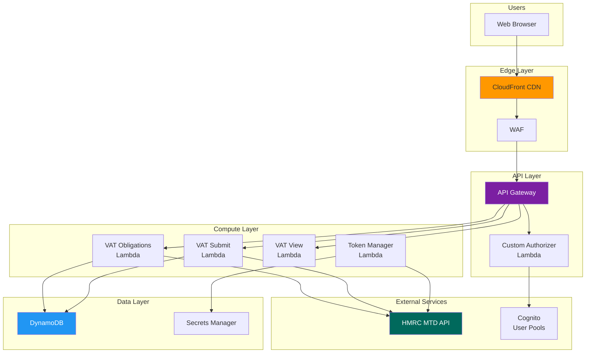

### 2.2 Request Flow

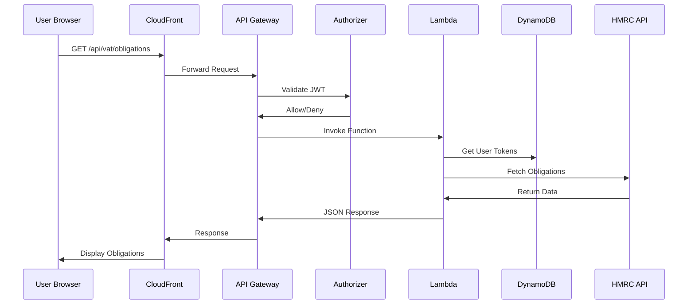

---

## 3. Service Components

### 3.1 Edge Layer

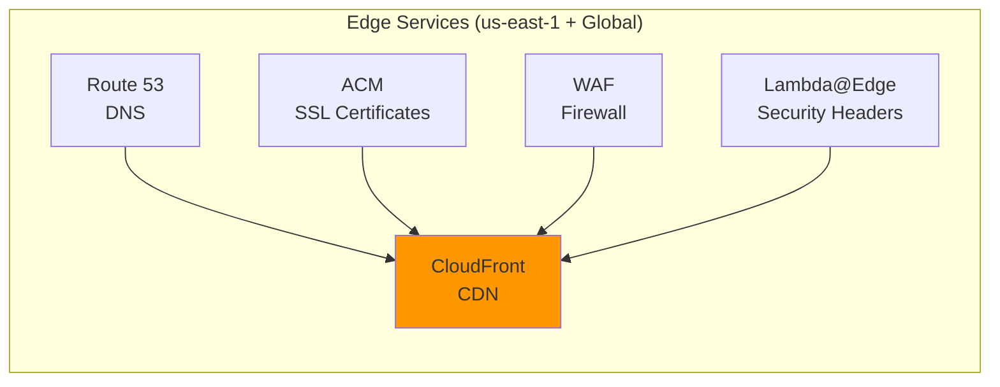

| Service | Purpose | Configuration |
|---------|---------|---------------|
| Route 53 | DNS management | submit.diyaccounting.co.uk |
| CloudFront | Content delivery | Origin: S3 + API Gateway |
| WAF | Web firewall | Rate limiting, SQL injection protection |
| Lambda@Edge | Security headers | CSP, HSTS, X-Frame-Options |
| ACM | SSL/TLS | Wildcard certificate |

### 3.2 API Layer

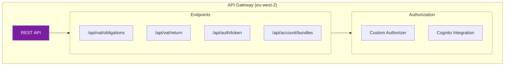

### 3.3 Compute Layer (Lambda Functions)

| Function | Purpose | Trigger | Memory |
|----------|---------|---------|--------|
| `customAuthorizer` | JWT validation | API Gateway | 256 MB |
| `hmrcVatObligationsGet` | Fetch VAT obligations | API Gateway | 512 MB |
| `hmrcVatReturnPost` | Submit VAT return | API Gateway | 512 MB |
| `hmrcVatReturnGet` | View submitted returns | API Gateway | 512 MB |
| `hmrcTokenRefresh` | OAuth token refresh | EventBridge (scheduled) | 256 MB |
| `accountBundlesGet` | User subscription info | API Gateway | 256 MB |
| `securityHeaders` | Add security headers | CloudFront (Lambda@Edge) | 128 MB |

### 3.4 Data Layer

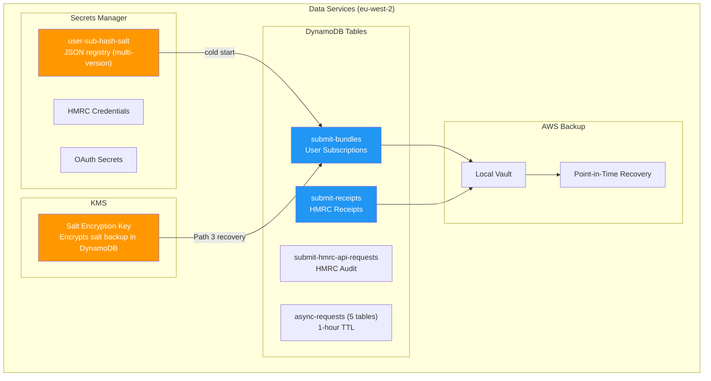

**Salt architecture**: The user sub hash salt is stored as a multi-version JSON registry in Secrets Manager. Each DynamoDB item includes a `saltVersion` field. A KMS key in DataStack encrypts a backup copy of the salt stored as a `system#config` item in the bundles table (recovery Path 3). This KMS key must move to the submit-backup account during account separation.

---

## 4. Security Architecture

### 4.1 Authentication Flow

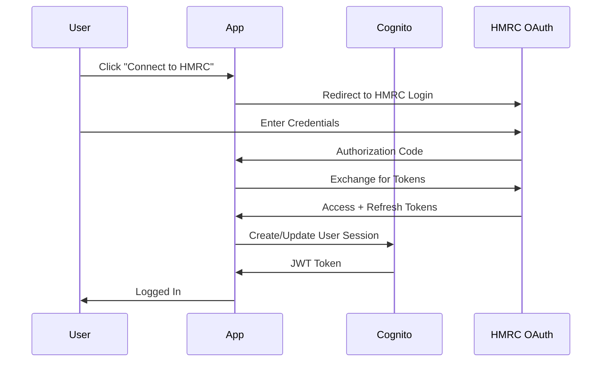

### 4.2 IAM Role Chain (GitHub Actions)

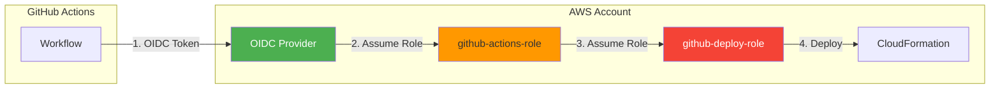

### 4.3 Network Security

| Control | Implementation |
|---------|----------------|
| **Encryption in Transit** | TLS 1.2+ enforced everywhere |
| **Encryption at Rest** | DynamoDB encryption, S3 SSE |
| **WAF Rules** | Rate limiting, SQL injection, XSS protection |
| **Security Headers** | CSP, HSTS, X-Content-Type-Options |
| **API Authentication** | JWT tokens via Cognito |
| **Secrets** | AWS Secrets Manager (no hardcoded credentials) |

---

## 5. Backup & Disaster Recovery

### 5.1 Backup Architecture

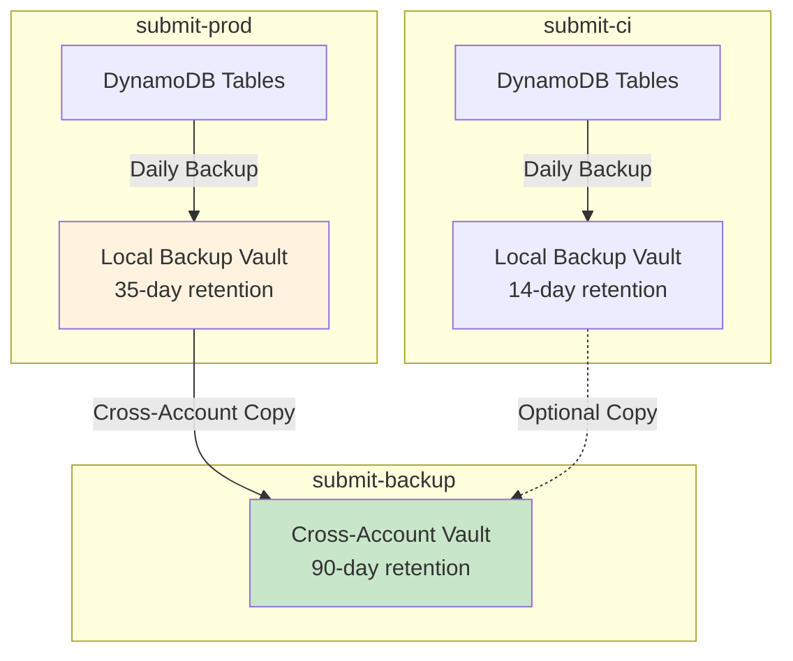

### 5.2 Recovery Objectives

| Metric | Target | Implementation |
|--------|--------|----------------|
| **RPO** (Recovery Point Objective) | < 24 hours | Daily backups + PITR |
| **RTO** (Recovery Time Objective) | < 4 hours | Automated restore scripts |
| **Backup Retention** | 90 days | Cross-account vault |

---

## 6. CI/CD Pipeline

### 6.1 Deployment Flow

```mermaid
graph LR
    subgraph dev["Development"]
        code["Code Change"]
        pr["Pull Request"]
    end

    subgraph ci["CI Pipeline"]
        test["Unit Tests"]
        lint["Linting"]
        build["CDK Synth"]
    end

    subgraph deploy_ci["Deploy to CI"]
        ci_stack["submit-ci Account"]
        e2e["E2E Tests"]
    end

    subgraph deploy_prod["Deploy to Prod"]
        approval["Manual Approval"]
        prod_stack["submit-prod Account"]
    end

    code --> pr
    pr --> test
    test --> lint
    lint --> build
    build --> ci_stack
    ci_stack --> e2e
    e2e --> approval
    approval --> prod_stack

    style ci_stack fill:#fff3e0
    style prod_stack fill:#c8e6c9
    style approval fill:#ffcdd2
```

### 6.2 Environment Mapping

| Git Branch | Target Account | Environment |
|------------|----------------|-------------|
| `feature/*`, `claude/*` | submit-ci | Development/Testing |
| `main` | submit-prod | Production |

---

## 7. Monitoring & Observability

### 7.1 Monitoring Stack

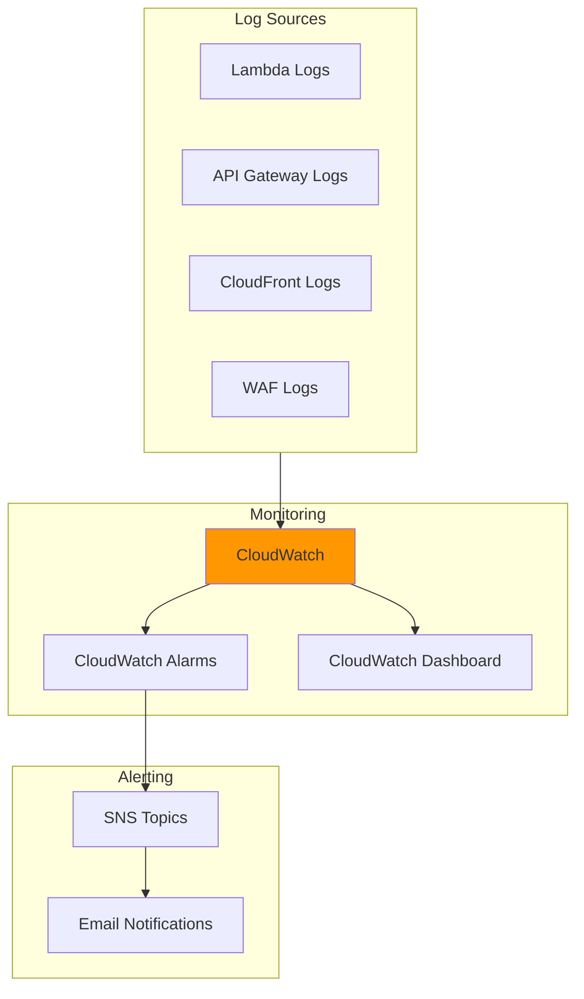

### 7.2 Key Metrics

| Metric | Threshold | Action |
|--------|-----------|--------|
| Lambda Errors | > 5% | Alert |
| API Latency (p99) | > 3s | Alert |
| DynamoDB Throttling | Any | Alert |
| 4xx Error Rate | > 10% | Alert |
| 5xx Error Rate | > 1% | Alert + Page |

---

## 8. Cost Optimization

### 8.1 Cost Distribution

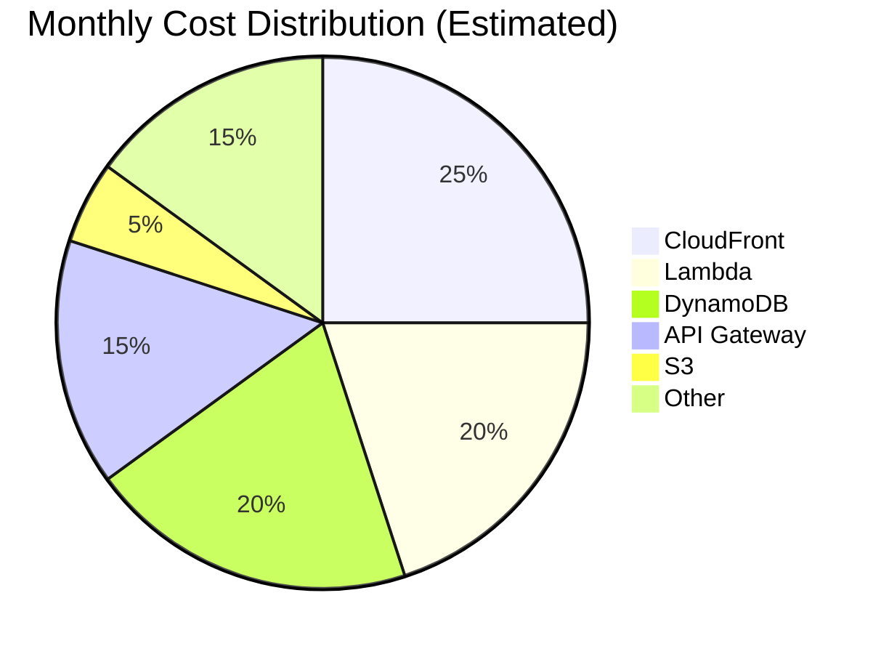

### 8.2 Optimization Strategies

| Strategy | Implementation | Savings |
|----------|----------------|---------|
| **Serverless-first** | No EC2 instances | ~60% vs traditional |
| **DynamoDB On-Demand** | Pay per request | Variable workloads |
| **CloudFront Caching** | Static asset caching | Reduced origin requests |
| **Lambda Right-sizing** | Memory optimization | ~20% Lambda costs |
| **Reserved Capacity** | Not used (low volume) | N/A |

---

## 9. Compliance

### 9.1 Compliance Framework

| Requirement | Implementation |
|-------------|----------------|
| **GDPR** | Data in eu-west-2, encryption, audit logs |
| **HMRC MTD** | Fraud prevention headers, secure token storage |
| **WCAG 2.2 AA** | Accessible UI, tested with axe-core |
| **OWASP Top 10** | WAF rules, security headers, input validation |

### 9.2 Audit Trail

All API calls logged to CloudWatch with:
- Timestamp
- User identity (masked)
- Action performed
- Resource affected
- Source IP (anonymized)

---

## 10. Infrastructure as Code

### 10.1 CDK Stack Structure

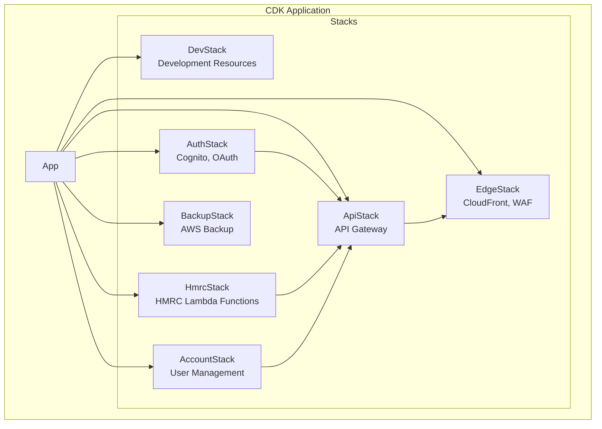

### 10.2 Key Files

| File | Purpose |
|------|---------|
| `cdk/src/main/java/.../App.java` | CDK entry point |
| `cdk/src/main/java/.../stacks/*.java` | Stack definitions |
| `cdk.json` | CDK configuration |
| `.github/workflows/deploy.yml` | CI/CD pipeline |

---

## Appendix A: AWS Service Inventory

| Service | Region | Account | Purpose |
|---------|--------|---------|---------|
| Route 53 | Global | submit-prod | DNS |
| CloudFront | Global | submit-prod | CDN |
| ACM | us-east-1 | submit-prod | SSL certificates |
| WAF | us-east-1 | submit-prod | Web firewall |
| API Gateway | eu-west-2 | submit-prod/ci | REST API |
| Lambda | eu-west-2, us-east-1 | submit-prod/ci | Compute |
| DynamoDB | eu-west-2 | submit-prod/ci | Database |
| Cognito | eu-west-2 | submit-prod/ci | Authentication |
| Secrets Manager | eu-west-2 | submit-prod/ci | Credentials |
| S3 | eu-west-2 | submit-prod/ci | Static assets |
| CloudWatch | eu-west-2 | submit-prod/ci | Monitoring |
| AWS Backup | eu-west-2 | All | Backup management |
| IAM Identity Center | eu-west-2 | submit-management | SSO |
| Organizations | Global | submit-management | Account management |

---

## Appendix B: Network Diagram

```
┌─────────────────────────────────────────────────────────────────────────────┐
│                              INTERNET                                        │
└─────────────────────────────────────────────────────────────────────────────┘
                                    │
                                    ▼
┌─────────────────────────────────────────────────────────────────────────────┐
│                         Route 53 (DNS)                                       │
│                    submit.diyaccounting.co.uk                                │
└─────────────────────────────────────────────────────────────────────────────┘
                                    │
                                    ▼
┌─────────────────────────────────────────────────────────────────────────────┐
│                    CloudFront (CDN + WAF)                                    │
│  ┌─────────────┐    ┌─────────────┐    ┌─────────────┐                      │
│  │ WAF Rules   │    │ SSL/TLS     │    │ Lambda@Edge │                      │
│  │ Rate Limit  │    │ TLS 1.2+    │    │ Sec Headers │                      │
│  └─────────────┘    └─────────────┘    └─────────────┘                      │
└─────────────────────────────────────────────────────────────────────────────┘
                          │                    │
              ┌───────────┘                    └───────────┐
              ▼                                            ▼
┌──────────────────────────┐              ┌──────────────────────────┐
│     S3 (Static Assets)   │              │     API Gateway          │
│  ┌────────────────────┐  │              │  ┌────────────────────┐  │
│  │ index.html         │  │              │  │ /api/vat/*         │  │
│  │ CSS/JS bundles     │  │              │  │ /api/auth/*        │  │
│  │ Images             │  │              │  │ /api/account/*     │  │
│  └────────────────────┘  │              │  └────────────────────┘  │
└──────────────────────────┘              └──────────────────────────┘
                                                       │
                                                       ▼
                                          ┌──────────────────────────┐
                                          │   Custom Authorizer      │
                                          │   (JWT Validation)       │
                                          └──────────────────────────┘
                                                       │
                                                       ▼
┌─────────────────────────────────────────────────────────────────────────────┐
│                           Lambda Functions                                   │
│  ┌─────────────┐  ┌─────────────┐  ┌─────────────┐  ┌─────────────┐        │
│  │ VAT Get     │  │ VAT Post    │  │ VAT View    │  │ Token Mgr   │        │
│  └─────────────┘  └─────────────┘  └─────────────┘  └─────────────┘        │
└─────────────────────────────────────────────────────────────────────────────┘
              │                    │                    │
              ▼                    ▼                    ▼
┌──────────────────────────┐  ┌─────────────┐  ┌──────────────────────────┐
│       DynamoDB           │  │  Secrets    │  │      HMRC MTD API        │
│  ┌────────────────────┐  │  │  Manager    │  │  ┌────────────────────┐  │
│  │ submit-tokens      │  │  └─────────────┘  │  │ api.service.hmrc   │  │
│  │ submit-bundles     │  │                   │  │ .gov.uk            │  │
│  └────────────────────┘  │                   │  └────────────────────┘  │
└──────────────────────────┘                   └──────────────────────────┘
```

---

*Document generated: January 2026*
*Architecture version: 2.0 (Multi-Account)*
