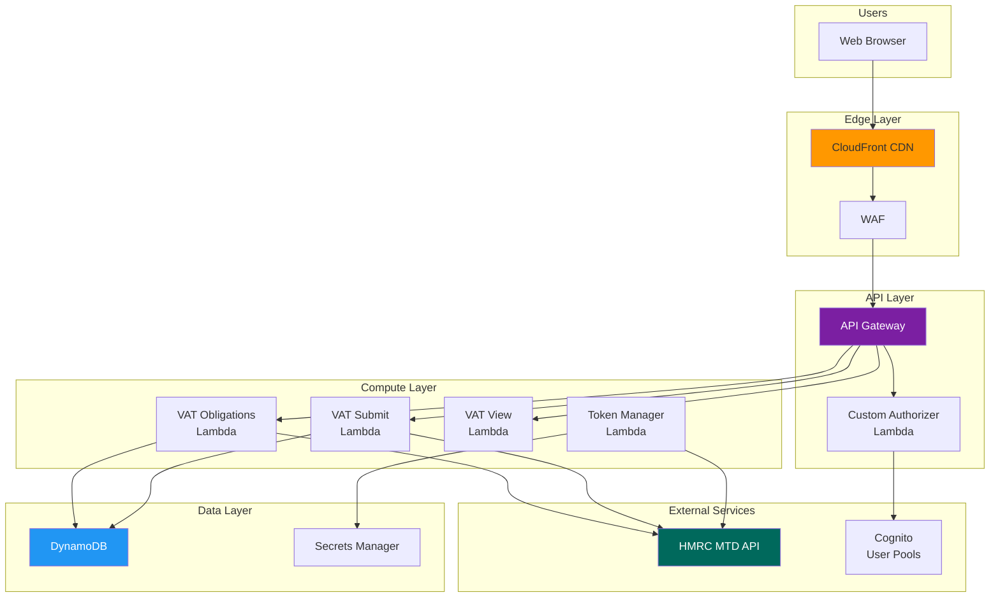
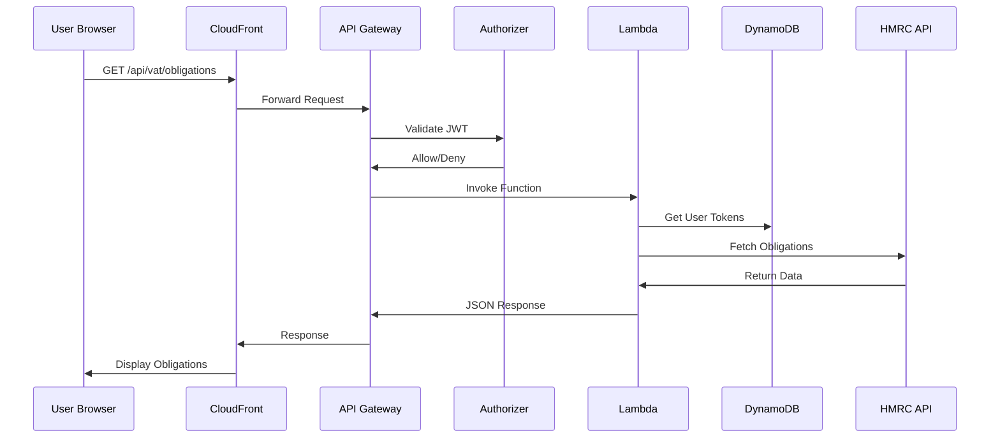
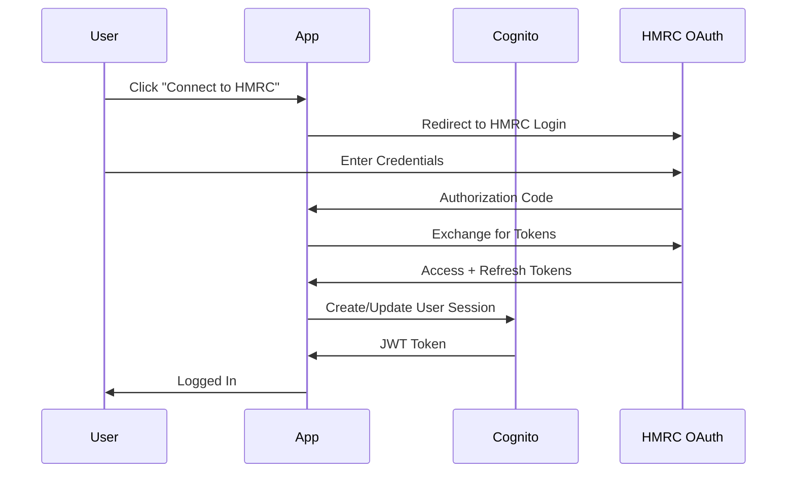
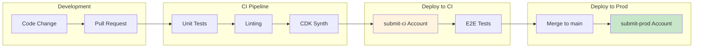

# DIY Accounting Submit - AWS Architecture

**Version**: 3.0
**Date**: February 2026
**Status**: Production

---

## Executive Summary

DIY Accounting Submit is a serverless web application enabling UK businesses to submit VAT returns directly to HMRC via the Making Tax Digital (MTD) API. The architecture leverages AWS services for scalability, security, and cost-efficiency.

**Key Characteristics:**
- Fully serverless (no EC2 instances)
- Multi-account AWS Organization (6 accounts) for security isolation
- Infrastructure as Code (AWS CDK in Java)
- CI/CD via GitHub Actions with OIDC authentication

---

## 1. Multi-Account Structure

### 1.1 Account Overview

```
AWS Organization Root (887764105431) ── Management
├── gateway ─────────── Workloads OU
├── spreadsheets ────── Workloads OU
├── submit-ci ──────────── Workloads OU
├── submit-prod ─────────── Workloads OU
├── submit-backup ─────── Backup OU
```

887764105431 is the **management account** and contains only: AWS Organizations, IAM Identity Center, Route53 zone (`diyaccounting.co.uk`), consolidated billing, root DNS stack, and holding page. No application workloads.

### 1.2 Account Responsibilities

| Account | Purpose | Contains |
|---------|---------|----------|
| **887764105431** (management) | Organization administration | IAM Identity Center, Organizations, Route53, consolidated billing, root DNS, holding page |
| **gateway** | Gateway static site | CloudFront, S3, CloudFront Functions (redirects) |
| **spreadsheets** | Spreadsheets static site | CloudFront, S3, package hosting |
| **submit-ci** | Submit CI/CD testing | Full submit stack with test data, HMRC sandbox |
| **submit-prod** | Submit production | Full submit stack with live data, HMRC production |
| **submit-backup** | Backup isolation | Cross-account backup vault only |

### 1.3 Why This Topology

**Why 6 accounts (not 1, 3, or 5)?**

| Question | Answer |
|----------|--------|
| Why not single account? | CI can interfere with prod, backups not isolated (ransomware risk), IAM clutter, unclear cost attribution |
| Why not 3 (management + ci + prod)? | No backup isolation, gateway/spreadsheets mixed with submit |
| Why separate gateway and spreadsheets? | Each service deploys independently; separate repos post-separation |
| Why dedicated backup account? | Critical for ransomware protection — compromised prod cannot delete backups |
| Why dedicated management? | AWS best practice; no workloads in management. Proves IaC repeatability. |
| Why not Control Tower? | Too complex for single developer; easy to add later |

**AWS Well-Architected Alignment:**

| Pillar | Score | Key Implementation |
|--------|-------|--------------------|
| Security | 7/7 | Account isolation, centralized SSO, backup separation |
| Operational Excellence | 4/4 | IaC (CDK), automated CI/CD, clear ownership |
| Reliability | 5/5 | Account-level fault isolation, cross-account backup |
| Cost Optimization | 4/4 | Consolidated billing, per-account visibility |
| Performance | 2/2 | Consistent architecture, per-account metrics |
| Sustainability | 2/2 | eu-west-2 (low-carbon), on-demand CI |

### 1.4 Security Rationale

Account boundaries provide the strongest isolation AWS offers:

- **CI cannot affect prod** — separate accounts, separate IAM, separate service limits
- **Compromised prod cannot delete backups** — backup vault in different account with separate credentials
- **Gateway/spreadsheets isolation** — static sites cannot access submit data
- **Management account is clean** — minimal attack surface, no application code

### 1.5 Console Access

IAM Identity Center provides single sign-on across all accounts:

- One SSO portal URL (`https://d-9c67480c02.awsapps.com/start/`)
- One set of credentials with MFA
- Click to access any account with assigned permission set
- AWS CLI SSO profiles for programmatic access

See `_developers/aws-multi-account/IAM_IDENTITY_CENTER.md` for setup details.

---

## 2. Application Architecture

### 2.1 High-Level Overview



### 2.2 Request Flow



---

## 3. Service Components

### 3.1 Edge Layer

| Service | Purpose | Configuration |
|---------|---------|---------------|
| Route 53 | DNS management | `diyaccounting.co.uk` zone in management account (887764105431) |
| CloudFront | Content delivery | Origin: S3 + API Gateway |
| WAF | Web firewall | Rate limiting, SQL injection protection |
| Lambda@Edge | Security headers | CSP, HSTS, X-Frame-Options |
| ACM | SSL/TLS | Per-account certificates, DNS validation via management Route53 |

### 3.2 API Layer

| Endpoint | Method | Purpose |
|----------|--------|---------|
| `/api/vat/obligations` | GET | Fetch VAT obligations from HMRC |
| `/api/vat/return` | POST | Submit VAT return to HMRC |
| `/api/vat/return` | GET | View submitted returns |
| `/api/auth/token` | POST | Exchange Cognito token |
| `/api/account/bundles` | GET | User subscription info |
| `/api/billing/*` | Various | Stripe payment integration |

### 3.3 Compute Layer (Lambda Functions)

| Function | Purpose | Trigger | Memory |
|----------|---------|---------|--------|
| `customAuthorizer` | JWT validation | API Gateway | 256 MB (PC) |
| `hmrcVatObligationsGet` | Fetch VAT obligations | API Gateway (async) | 1024 MB |
| `hmrcVatReturnPost` | Submit VAT return | API Gateway (async) | 256 MB (PC) |
| `hmrcVatReturnGet` | View submitted returns | API Gateway (async) | 1024 MB |
| `hmrcTokenRefresh` | OAuth token refresh | EventBridge (scheduled) | 1024 MB |
| `accountBundlesGet` | User subscription info | API Gateway | 256 MB (PC) |
| `cognitoTokenPost` | Cognito token exchange | API Gateway | 256 MB (PC) |
| `securityHeaders` | Add security headers | CloudFront (Lambda@Edge) | 128 MB |

PC = Provisioned Concurrency (always warm). See `AWS_COSTS.md` for memory sizing rationale.

### 3.4 Data Layer

| Table | Purpose | Backup |
|-------|---------|--------|
| `submit-bundles` | User subscriptions + salt backup | PITR + cross-account |
| `submit-receipts` | HMRC submission receipts (7-year TTL) | PITR + cross-account |
| `submit-hmrc-api-requests` | HMRC API audit log | PITR |
| `async-requests` (5 tables) | Async request correlation (1-hour TTL) | None (ephemeral) |

**Salt architecture**: The user sub hash salt is stored as a multi-version JSON registry in Secrets Manager. Each DynamoDB item includes a `saltVersion` field. A KMS key encrypts a backup copy of the salt stored as a `system#config` item in the bundles table (recovery Path 3). During account separation, this KMS key must be accessible for cross-account salt restoration.

---

## 4. Security Architecture

### 4.1 Authentication Flow



### 4.2 IAM Role Chain (GitHub Actions)

Each workload account has its own OIDC provider and role chain:

```
GitHub Actions OIDC Token
  → token.actions.githubusercontent.com (OIDC Provider in target account)
    → github-actions-role (AssumeRoleWithWebIdentity)
      → deployment-role (AssumeRole, used by CDK)
        → CloudFormation (deploys stacks)
```

Trust scoped to `repo:antonycc/submit.diyaccounting.co.uk:*` (updated per repo after Phase 2 repo separation; root repo is `antonycc/root.diyaccounting.co.uk`).

### 4.3 Network Security

| Control | Implementation |
|---------|----------------|
| **Encryption in Transit** | TLS 1.2+ enforced everywhere |
| **Encryption at Rest** | DynamoDB encryption, S3 SSE |
| **WAF Rules** | Rate limiting, SQL injection, XSS protection |
| **Security Headers** | CSP, HSTS, X-Content-Type-Options |
| **API Authentication** | JWT tokens via Cognito |
| **Secrets** | AWS Secrets Manager (no hardcoded credentials) |

---

## 5. Backup & Disaster Recovery

### 5.1 Backup Architecture

```
submit-prod                    submit-backup
  DynamoDB tables ──────────→  Cross-account vault
  (PITR + daily backup)        (90-day retention)

submit-ci                      submit-backup
  DynamoDB tables ──────────→  Cross-account vault (optional)
  (PITR + daily backup)
```

### 5.2 Recovery Objectives

| Metric | Target | Implementation |
|--------|--------|----------------|
| **RPO** (Recovery Point Objective) | < 24 hours | Daily backups + PITR |
| **RTO** (Recovery Time Objective) | < 4 hours | Automated restore scripts |
| **Backup Retention** | 90 days | Cross-account vault |

### 5.3 Disaster Recovery Strategy

IaC repeatability is proven by the account separation itself (Phase 1.4): submit-prod is deployed fresh to a new account from code + backups + salt. This validates that total account loss is recoverable.

---

## 6. CI/CD Pipeline

### 6.1 Deployment Flow



### 6.2 Environment Mapping

| Git Branch | Target Account | Environment |
|------------|----------------|-------------|
| `feature/*`, `claude/*` | submit-ci | Development/Testing |
| `main` | submit-prod | Production |

### 6.3 Multi-Site Deployments

| Site | Workflow | Target Account |
|------|----------|----------------|
| submit.diyaccounting.co.uk | `deploy.yml` | submit-ci / submit-prod |
| diyaccounting.co.uk (gateway) | `deploy-gateway.yml` | gateway |
| spreadsheets.diyaccounting.co.uk | `deploy-spreadsheets.yml` | spreadsheets |
| Root DNS + holding page | `antonycc/root.diyaccounting.co.uk` repo | 887764105431 (management) |

---

## 7. Monitoring & Observability

### 7.1 Key Metrics

| Metric | Threshold | Action |
|--------|-----------|--------|
| Lambda Errors | > 5% | Alert |
| API Latency (p99) | > 3s | Alert |
| DynamoDB Throttling | Any | Alert |
| 4xx Error Rate | > 10% | Alert |
| 5xx Error Rate | > 1% | Alert + Page |

### 7.2 Synthetics

2 canary checks run every 51 minutes (health check + API check). See `AWS_COSTS.md` for interval rationale.

---

## 8. Cost

See **`AWS_COSTS.md`** for detailed cost analysis including:
- Multi-account consolidated billing and free tier implications
- Per-service cost breakdown with actuals
- Per-user marginal cost scaling
- Optimization strategies and projections

---

## 9. Compliance

| Requirement | Implementation |
|-------------|----------------|
| **GDPR** | Data in eu-west-2, encryption, audit logs, PII only in submit-prod |
| **HMRC MTD** | Fraud prevention headers, secure token storage |
| **WCAG 2.2 AA** | Accessible UI, tested with axe-core |
| **OWASP Top 10** | WAF rules, security headers, input validation |

All API calls logged to CloudWatch with timestamp, user identity (masked), action, resource, and source IP (anonymized).

---

## 10. Infrastructure as Code

### 10.1 CDK Applications

| CDK App | Directory | Purpose |
|---------|-----------|---------|
| Application | `cdk-application/` | Per-deployment submit stacks (Auth, HMRC, Account, Billing, Api, Edge, etc.) |
| Environment | `cdk-environment/` | Per-environment shared stacks (Identity, Data, Observability) |
| Gateway | `cdk-gateway/` | Gateway static site stack |
| Spreadsheets | `cdk-spreadsheets/` | Spreadsheets static site stack |

### 10.2 Stack Naming

- Environment stacks: `{env}-env-{StackName}` (e.g., `ci-env-IdentityStack`, `prod-env-DataStack`)
- Application stacks: `{deployment}-app-{StackName}` (e.g., `ci-cleanlogin-app-AuthStack`)

---

## Appendix A: AWS Service Inventory

| Service | Region | Account | Purpose |
|---------|--------|---------|---------|
| Organizations | Global | 887764105431 (management) | Account management |
| IAM Identity Center | eu-west-2 | 887764105431 (management) | SSO |
| Route 53 | Global | 887764105431 (management) | DNS for all sites |
| CloudFront | Global | gateway | Gateway CDN |
| CloudFront | Global | spreadsheets | Spreadsheets CDN |
| CloudFront | Global | submit-prod / submit-ci | Submit CDN + holding page |
| ACM | us-east-1 | Each workload account | SSL certificates |
| WAF | us-east-1 | submit-prod / submit-ci | Web firewall |
| API Gateway | eu-west-2 | submit-prod / submit-ci | REST API |
| Lambda | eu-west-2, us-east-1 | submit-prod / submit-ci | Compute |
| DynamoDB | eu-west-2 | submit-prod / submit-ci | Database |
| Cognito | eu-west-2 | submit-prod / submit-ci | Authentication |
| Secrets Manager | eu-west-2 | submit-prod / submit-ci | Credentials |
| S3 | eu-west-2 | Each workload account | Static assets |
| CloudWatch | eu-west-2 | Each workload account | Monitoring |
| AWS Backup | eu-west-2 | submit-prod, submit-backup | Backup management |
| ECR | eu-west-2, us-east-1 | submit-prod / submit-ci | Docker images |

---

## Appendix B: Network Diagram

```
┌─────────────────────────────────────────────────────────────────────────────┐
│                              INTERNET                                       │
└─────────────────────────────────────────────────────────────────────────────┘
                                    │
                                    ▼
┌─────────────────────────────────────────────────────────────────────────────┐
│                   Route 53 (887764105431 management)                        │
│                    *.diyaccounting.co.uk                                    │
└─────────────────────────────────────────────────────────────────────────────┘
           │                    │                        │
           ▼                    ▼                        ▼
  ┌──────────────┐    ┌──────────────────┐    ┌──────────────────────┐
  │ gateway  │    │ spreadsheets │    │ submit-prod          │
  │ CloudFront   │    │ CloudFront       │    │ CloudFront + WAF     │
  │   ↓          │    │   ↓              │    │   ↓            ↓     │
  │ S3 (static)  │    │ S3 (static +     │    │ S3 (static) API GW  │
  │              │    │    packages)      │    │              ↓      │
  └──────────────┘    └──────────────────┘    │         Authorizer   │
                                              │              ↓      │
                                              │         Lambda fns   │
                                              │          ↓      ↓   │
                                              │      DynamoDB  HMRC │
                                              └──────────────────────┘
```

---

*Document generated: February 2026*
*Architecture version: 3.0 (Multi-Account, 6 accounts)*
