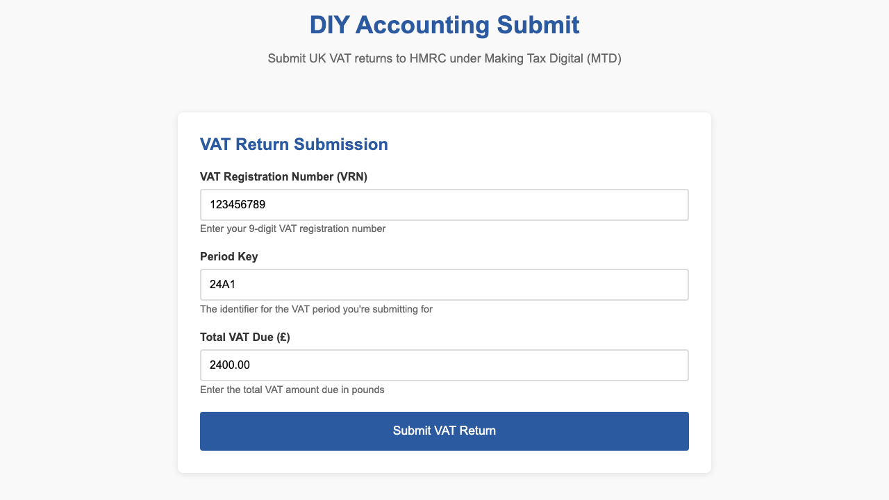

Hello Codex! 👋

# DIY Accounting Submit

This project allows UK businesses to submit tax returns to HMRC under the Making Tax Digital (MTD) framework. It simplifies interactions through HMRC’s official APIs, providing streamlined VAT submissions initially via a straightforward web interface.

---

## User Flow & Behaviour

### Step 1: Initial Page Load

Upon navigating to the application, the user is presented with a simple, pre-populated VAT submission form.
**Fig. 1** (see below) shows the initial state.



<figcaption><b>Fig. 1.</b> Initial state of the VAT submission form as rendered to the user. The form is pre-filled with example values, ready for editing.</figcaption>

See the [User Guide](USERGUIDE.md) for more details on the user flow and behaviour.

---

# Build and run locally

## Clone the Repository

```bash

git clone git@github.com:antonycc/submit.diyaccounting.co.uk.git
cd submit.diyaccounting.co.uk.git
```

## Install Node.js dependencies and test

```bash

npm install
npm test
```

## Run the website locally

Register your HMRC OAuth application at [HMRC Developer Hub](https://developer.service.hmrc.gov.uk/),
and set the following environment variables in a `.env` file:
```env
DIY_SUBMIT_HMRC_CLIENT_ID=your_hmrc_client_id
DIY_SUBMIT_HMRC_CLIENT_SECRET=your_hmrc_client_secret
DIY_SUBMIT_HOME_URL=https://your-ngrok-domain.ngrok-free.app/
DIY_SUBMIT_HMRC_BASE_URI=https://test-api.service.hmrc.gov.uk
DIY_SUBMIT_GOOGLE_CLIENT_ID=your_google_client_id
DIY_SUBMIT_GOOGLE_CLIENT_SECRET=your_google_client_secret
```

Run the web server:
```bash

npm install
npm run start
```
Access via [http://127.0.0.1:3000](http://127.0.0.1:3000) or...

Run [ngrok](https://ngrok.com/) to expose http://127.0.0.1:3000 to an SSL terminated public URL:
```bash

npm install
npm run proxy
```

✅ MinIO Setup Steps
Run MinIO locally (e.g. with Docker):
```bash
docker run -p 9000:9000 -p 9001:9001 \
  -e "MINIO_ROOT_USER=minioadmin" \
  -e "MINIO_ROOT_PASSWORD=minioadmin" \
  quay.io/minio/minio server /data --console-address ":9001"
```

If you need the MinIO client (`mc`), install it from [MinIO Client Quickstart Guide](https://docs.min.io/docs/minio-client-quickstart-guide.html).
e.g. On macOS with Homebrew:
```bash

brew install minio/stable/mc
```


Create the bucket (e.g. using mc CLI):
```bash
mc alias set local http://localhost:9000 minioadmin minioadmin
mc mb local/vat-receipts
mc mb test
```

Or use an ngrok account to get a stable URL and set this in package.json:
```json
{
...
  "scripts": {
    ...
    "start": "node app/lib/server.js",
    "proxy": "npx ngrok http --url wanted-finally-anteater.ngrok-free.app 3000"
  },
```

Then run:
```bash

npm run proxy
```

ngrok runs:
```log
ngrok                                                                                                                                                                                                          (Ctrl+C to quit)

🤖 Want to hang with ngrokkers on our new Discord? http://ngrok.com/discord                                                                                                                                                    

Session Status                online                                                                                                                                                                                           
Account                       Antony @ Polycode (Plan: Free)                                                                                                                                                                   
Version                       3.22.1                                                                                                                                                                                           
Region                        Europe (eu)                                                                                                                                                                                      
Web Interface                 http://127.0.0.1:4040                                                                                                                                                                            
Forwarding                    https://d57b-146-70-103-222.ngrok-free.app -> http://localhost:3000                                                                                                                              

Connections                   ttl     opn     rt1     rt5     p50     p90                                                                                                                                                      
                              0       0       0.00    0.00    0.00    0.00                  
```

Here you can open https://d57b-146-70-103-222.ngrok-free.app in a browser of your choice (you'll have your own URL
unless I am still running this one, I don't know when the id's roll so I might).

Continued in [SETUP.md](_developers/SETUP.md).

---

## 🎯 MVP (Initial Release)

### Features:

* Basic HTML form to submit VAT returns.
* No persistent identity—OAuth performed per submission.
* Submission status and receipts stored securely in AWS S3.

### Tech Stack:

* **Frontend:** HTML5, JavaScript
* **Backend:** Node.js (Express.js), AWS Lambda
* **Infrastructure:** AWS CDK (Java), AWS S3, AWS SQS
* **Authentication:** HMRC OAuth 2.0 (Authorization Code Grant)

### ⚡ Step-by-step User Journey (Simplest VAT Submission)

### Step 1: Open Submission Page

* User opens the **submission webpage** you provide (your MVP site).
* Presented with a simple HTML form to input VAT details:

    * **VAT registration number** (VRN)
    * **Period Key** (the identifier for the VAT period they're submitting for)
    * **Total VAT Due**
    * (Other minimum fields depending on obligation)

---

### Step 2: User Completes the VAT Submission Form

User fills in the form fields, e.g.:

| Field                   | Example Input |
| ----------------------- | ------------- |
| VAT Registration Number | 193054661     |
| Period Key              | 24A1          |
| VAT Due                 | £2,400.00     |

Then clicks **Submit VAT Return**.

---

### Step 3: Redirect to HMRC for Authentication

Since no retained tokens exist, the system initiates a fresh HMRC OAuth flow:

* User is redirected automatically to HMRC’s **OAuth consent screen**.
* URL example:

```
https://api.service.hmrc.gov.uk/oauth/authorize
  ?response_type=code
  &client_id=YOUR_DIY_SUBMIT_HMRC_CLIENT_ID
  &redirect_uri=https://yourapp.com/callback
  &scope=write:vat+read:vat
  &state=randomly-generated-string
```

---

### Step 4: User Logs in at HMRC (Government Gateway)

User sees HMRC's official login screen:

* User enters their HMRC **Government Gateway ID and password**.
* HMRC prompts user to **consent** to allow your app to submit VAT returns.

---

### Step 5: HMRC Redirects Back to Your App with an Auth Code

After login and consent, HMRC sends the user back to your app at your configured `redirect_uri`:

* Example redirect:

```
https://yourapp.com/callback?code=AUTHORIZATION_CODE&state=randomly-generated-string
```

* Your app verifies the state matches the one sent initially.

---

### Step 6: Your App Exchanges Auth Code for Access Token

Your backend makes a server-to-server request (user sees nothing):

* Request:

```http
POST https://api.service.hmrc.gov.uk/oauth/token
Content-Type: application/x-www-form-urlencoded

grant_type=authorization_code&
client_id=YOUR_DIY_SUBMIT_HMRC_CLIENT_ID&
client_secret=YOUR_HMRC_SECRET&
redirect_uri=https://yourapp.com/callback&
code=AUTHORIZATION_CODE
```

* Response (example):

```json
{
  "access_token": "ACCESS_TOKEN",
  "refresh_token": "REFRESH_TOKEN",
  "expires_in": 14400,
  "token_type": "Bearer",
  "scope": "write:vat read:vat"
}
```

> You won't retain tokens here, as per your MVP scenario.

---

### Step 7: Your App Calls HMRC VAT API to Retrieve Obligations (optional but recommended)

Typically, first, confirm the period you're submitting for is correct:

* GET obligations:

```http
GET https://api.service.hmrc.gov.uk/organisations/vat/193054661/obligations
Authorization: Bearer ACCESS_TOKEN
```

This confirms available periods, and statuses, e.g.:

```json
{
  "obligations": [
    {
      "start": "2025-01-01",
      "end": "2025-03-31",
      "due": "2025-05-07",
      "status": "O",
      "periodKey": "24A1"
    }
  ]
}
```

---

### Step 8: Submit VAT Return to HMRC via API

Use the data from the form to POST to HMRC's API:

* POST VAT return:

```http
POST https://api.service.hmrc.gov.uk/organisations/vat/193054661/returns
Authorization: Bearer ACCESS_TOKEN
Content-Type: application/json

{
  "periodKey": "24A1",
  "vatDueSales": 2400.00,
  "vatDueAcquisitions": 0.00,
  "totalVatDue": 2400.00,
  "vatReclaimedCurrPeriod": 0.00,
  "netVatDue": 2400.00,
  "totalValueSalesExVAT": 12000.00,
  "totalValuePurchasesExVAT": 0.00,
  "totalValueGoodsSuppliedExVAT": 0.00,
  "totalAcquisitionsExVAT": 0.00,
  "finalised": true
}
```

* HMRC Response (success example):

```json
{
  "processingDate": "2025-07-14T20:20:20Z",
  "paymentIndicator": "BANK",
  "formBundleNumber": "123456789012",
  "chargeRefNumber": "XZ1234567890"
}
```

---

### Step 9: Display Submission Result to User

Your app shows the result clearly:

* Confirmation page with **Processing date**, **Form Bundle Number**, and **Charge Ref**.

Example:

```
✅ VAT Return Submitted Successfully!

Date processed: 14 July 2025
Form bundle number: 123456789012
Charge reference: XZ1234567890
```

---

### Step 10: (Optional) Log the Submission Receipt

* Store a copy of the submission receipt securely (e.g., AWS S3 bucket), providing user with a link to view/download the official HMRC acknowledgment.

---

## 🔒 HMRC API & OAuth Summary Reference:

* OAuth docs: [HMRC OAuth guide](https://developer.service.hmrc.gov.uk/api-documentation/docs/authorisation)
* VAT docs: [HMRC VAT MTD API docs](https://developer.service.hmrc.gov.uk/api-documentation/docs/api/service/vat-api)
* Sandbox Test Users: [Creating HMRC test users](https://developer.service.hmrc.gov.uk/api-test-user)

---

## License

This project is licensed under the GNU General Public License (GPL). See [LICENSE](LICENSE) for details.

License notice:
```
DIY Accounting Submit - submit.diyaccounting.co.uk
Copyright (C) 2025 DIY Accounting Limited

DIY Accounting Submit is free software: you can redistribute it and/or modify
it under the terms of the GNU General Public License as published by
the Free Software Foundation, either version 3 of the License, or
(at your option) any later version.

This program is distributed in the hope that it will be useful,
but WITHOUT ANY WARRANTY; without even the implied warranty of
MERCHANTABILITY or FITNESS FOR A PARTICULAR PURPOSE. See the
GNU General Public License for more details.

You should have received a copy of the GNU General Public License v3.0 (GPL‑3).
along with this program. If not, see <https://www.gnu.org/licenses/>.

IMPORTANT: Any derived work must include the following attribution:
"This work is derived from https://github.com/xn-intenton-z2a/agentic-lib"
```


## Bundles (Authenticated)

This repository now includes an authenticated “bundle” mechanism so users can self‑enable feature access, starting with the HMRC Test API bundle.

- Request a bundle at: bundles.html (Add HMRC Test API Bundle)
- The front‑end sends Authorization: Bearer idToken to /api/request-bundle
- The bundle Lambda stores the grant in Cognito custom:bundles (live) or an in‑memory store when running locally in MOCK mode
- Activities are rendered based on granted bundles. Default activities are visible to all. HMRC Test activities appear once HMRC_TEST_API is granted.

Notes about environments:
- Local/dev: By default, tests and local proxy run with DIY_SUBMIT_BUNDLE_MOCK=true, so no AWS calls are made. This keeps development fast and offline‑friendly.
- Cloud/prod: When deployed with Cognito, the Lambda reads and updates custom:bundles and enforces user/expiry limits.

### Environment keys for bundles (non‑secret)
Already provided in .env.test and .env.proxy for local use:
- DIY_SUBMIT_BUNDLE_EXPIRY_DATE
- DIY_SUBMIT_BUNDLE_USER_LIMIT
- DIY_SUBMIT_BUNDLE_MOCK
- AWS_REGION
- DIY_SUBMIT_USER_POOL_ID (stubbed for local use; real value injected by CDK on deploy)

### Credentials in .env (secrets – names only)
Create an .env file at the project root and add your credentials. Only the keys are shown here, not values:
- DIY_SUBMIT_HMRC_CLIENT_SECRET
- DIY_SUBMIT_GOOGLE_CLIENT_SECRET

These are read by the app (and CDK) at runtime. Do not commit actual secret values.

## Run the proxy environment locally
The proxy environment gives you a realistic local run with ngrok, mock OAuth2 and local S3 (MinIO):

1) Terminal A – start the local server (uses .env.proxy):
- npm run start

2) Terminal B – expose via ngrok (uses .env.proxy):
- npm run proxy

3) Terminal C – start mock OAuth2 server (uses .env.proxy):
- npm run auth

4) Optional – local S3 for receipts (uses .env.proxy):
- npm run storage

Then open the ngrok URL (DIY_SUBMIT_HOME_URL from .env.proxy) and:
- Click Login and choose mock‑oauth2‑server
- Open bundles.html and click “Add HMRC Test API Bundle”
- Go to activities.html and you should see the Default and HMRC Test sections

## Running tests
All tests should pass locally:
- npm test
- npm run test:system
- npm run test:infra
- npm run test:behaviour

The behaviour suite includes a test that logs in via the mock callback, adds the Test bundle and verifies available activities reflect both Default and Test bundles.
