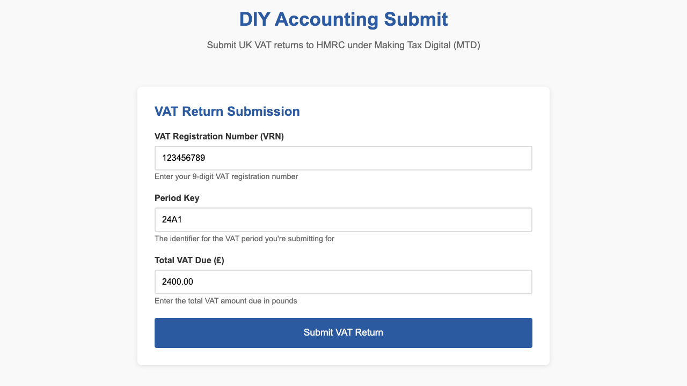
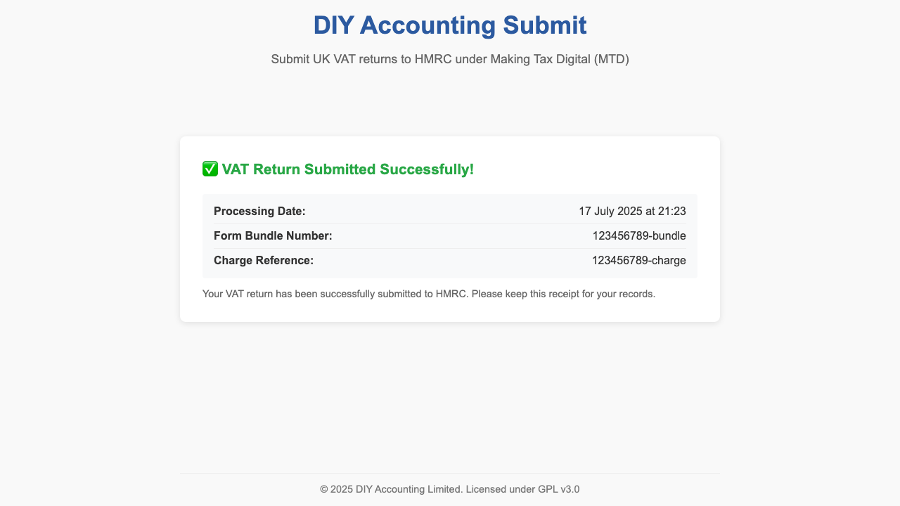

# DIY Accounting VAT Submission – User Guide

This guide explains how to use the DIY Accounting Submit system to send UK VAT returns to HMRC through the Making Tax Digital (MTD) API. Screenshots below were generated by the automated system and behaviour tests to illustrate correct usage and outcomes. 

## Quick Start

1. **Install dependencies and start the server:**
```bash
   npm install
   node app/lib/server.js
````

The app will be served at [http://127.0.0.1:3000](http://127.0.0.1:3000).

2. **Open the site in your browser** and fill in the VAT submission form.

---

## User Flow & Behaviour

### Step 1: Initial Page Load

Upon navigating to the application, the user is presented with a simple, pre-populated VAT submission form.
**Fig. 1** (see below) shows the initial state.



<figcaption><b>Fig. 1.</b> Initial state of the VAT submission form as rendered to the user. The form is pre-filled with example values, ready for editing.</figcaption>

---

### Step 2: Filling Out the Form

Enter your VAT Registration Number (must be 9 digits), Period Key (uppercase, e.g., "24A1"), and the VAT due for the period (must be a positive amount).

**Field validation occurs automatically:**

* All fields are required.
* VAT number must be exactly 9 digits.
* VAT due must be positive.
* Period key is converted to uppercase.

If the input is invalid, errors are shown and submission is blocked.

**Fig. 2** shows a correctly completed form:


<figcaption><b>Fig. 2.</b> The VAT submission form after user has entered all required fields. Form validation is enforced before submission.</figcaption>

---

### Step 3: Submission and OAuth Flow

On clicking **Submit VAT Return**:

* The form disables and a loading indicator appears.
* The system initiates the HMRC OAuth flow by redirecting you to the HMRC login/consent page.
* On successful login and consent, HMRC redirects you back to the app, which automatically exchanges the code for an access token and submits your VAT return.

**Fig. 3** shows the application state after the OAuth redirect:



<figcaption><b>Fig. 3.</b> After OAuth callback, the system exchanges the code for an access token and proceeds to submit the VAT return to HMRC. A loading spinner is shown during processing.</figcaption>

---

### Step 4: Receipt Display

On successful submission:

* The form is hidden.
* A submission receipt is displayed, including the HMRC processing date, bundle number, and charge reference.

**Fig. 4** shows the receipt view:


<figcaption><b>Fig. 4.</b> Confirmation receipt after successful VAT submission, showing all relevant HMRC return details and a processing timestamp.</figcaption>

---

## Validation and Error Feedback

* Field validation is immediate; errors are shown inline in red.
* Invalid VAT numbers, period keys, or negative/blank VAT due amounts will block submission and show an error.
* Errors received from HMRC or during network operations are displayed in an error box and do not disappear automatically.

---

## Technical Notes

* All client/server communication is via a REST API (see [README.md](README.md) for endpoints).
* Each submission uses a one-time OAuth flow and does not persist any tokens.
* Receipts are logged securely via the backend (typically to AWS S3 or compatible storage).

## Troubleshooting

* Ensure all fields are filled correctly and network access to the backend and HMRC is available.
* If you see errors regarding the OAuth flow, verify that your environment variables for HMRC API credentials are correctly set on the server.

## More Info

See [README.md](README.md) for architecture, API details, and licensing.

---

## License

This project is licensed under the GNU GPL v3. See [LICENSE](LICENSE).

```
**Fig. 1–4** in this document are produced from actual system tests and reflect real application behaviour in both user-facing and test automation contexts.
```

```
```
