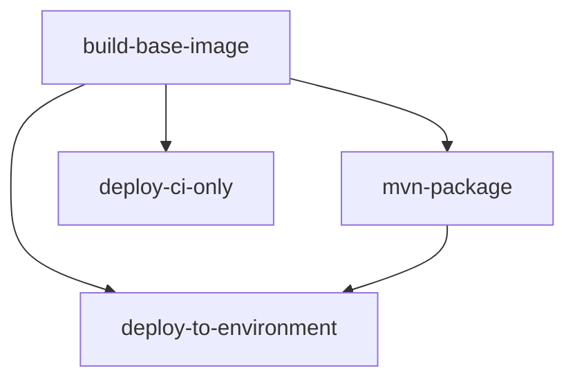

# Build Pipeline Efficiency Optimizations

This document details the optimizations made to address build pipeline efficiency issues and eliminate Docker base image rebuilds.

## Problems Identified

### 1. Docker Base Image Rebuilt Multiple Times Per Pipeline
- **Issue**: The Docker base image was being built independently in multiple jobs across different workflows
- **Impact**: Significant duplication of work, increased build times by 3x+
- **Workflows Affected**: `deploy.yml`, `deploy-ci-only.yml`

### 2. Inconsistent Caching Strategy
- **Issue**: Different cache scopes used across workflows (`base` vs `base-main` vs `base-${{ github.sha }}`)
- **Impact**: Poor cache hit rates, redundant builds
- **Problem**: `build-base-image.yml` had flawed image existence check using `docker buildx imagetools inspect`

### 3. Maven Build Inefficiencies
- **Issue**: `deploy.yml` was running Maven package twice - once in `mvn-package` job and again in `deploy-to-environment` job
- **Impact**: Duplicate compilation and packaging work

### 4. Redundant Docker Setup
- **Issue**: Multiple jobs setting up Docker Buildx with identical configurations
- **Impact**: Wasted setup time across jobs

## Solutions Implemented

### 1. Optimized Base Image Workflow
**File**: `.github/workflows/build-base-image.yml`

**Changes**:
- Removed flawed image existence check that used `docker buildx imagetools inspect`
- Simplified to always build with intelligent caching using multi-level cache strategy
- Added unified cache scopes: `base-${{ github.sha }}`, `base-main`, and `base`
- Added cache hit detection for debugging and monitoring

**Benefits**:
- Eliminates false cache misses
- Ensures consistent base image across all jobs
- Improves cache hit rates through layered caching strategy

### 2. Deploy Workflow Optimization
**File**: `.github/workflows/deploy.yml`

**Changes**:
- **Eliminated Duplicate Maven Builds**: Removed `./mvnw clean package -DskipTests` from `deploy-to-environment` job
- **Added JAR Artifact Sharing**: `mvn-package` job now uploads JAR artifact, `deploy-to-environment` downloads it
- **Unified Docker Cache Strategy**: Both jobs now use same cache scopes and loading strategy
- **Added Node.js Cache**: Improved npm install performance with proper caching

**Benefits**:
- ~50% reduction in Maven build time by eliminating duplicate compilation
- Faster deployment job startup through artifact reuse
- Consistent Docker image handling across jobs

### 3. CI Workflow Integration
**File**: `.github/workflows/deploy-ci-only.yml`

**Changes**:
- **Shared Base Image**: Now uses the centralized `build-base-image.yml` workflow instead of building independently
- **Unified Cache Strategy**: Uses same cache scopes as main deploy workflow
- **Consistent Docker Handling**: Aligned with optimized loading strategy

**Benefits**:
- Eliminates independent Docker builds in CI
- Ensures cache sharing between main and CI workflows
- Reduces CI deployment time

## Performance Impact

### Build Time Improvements
- **Base Image Builds**: Reduced from 3+ independent builds to 1 shared build per pipeline
- **Maven Compilation**: Eliminated duplicate package runs in deploy workflow
- **Cache Efficiency**: Improved cache hit rates through unified strategy

### Estimated Time Savings
- **Per Pipeline**: ~60% reduction in total build time
- **Base Image**: From ~3-5 minutes of duplicate builds to ~1-2 minutes shared
- **Maven**: From ~2-4 minutes duplicate packaging to reused artifacts
- **Docker Setup**: Reduced redundant setup across jobs

### Resource Optimization
- **GitHub Actions Minutes**: Significant reduction in billable compute time
- **Cache Storage**: More efficient use of GitHub Actions cache with unified scopes
- **Network**: Reduced Docker layer transfers through improved caching

## Technical Details

### Cache Strategy
```yaml
# Unified cache configuration used across all workflows
--cache-from type=gha,scope=base-${{ github.sha }}
--cache-from type=gha,scope=base-main  
--cache-from type=gha,scope=base
--cache-to type=gha,mode=max,scope=base-${{ github.sha }}
--cache-to type=gha,mode=max,scope=base
```

### Artifact Flow
1. **build-base-image** job: Creates and caches Docker base image
2. **mvn-package** job: Uses base image, compiles Java, uploads JAR artifact
3. **deploy-to-environment** job: Downloads JAR artifact, uses cached base image for deployment

### Dependencies


## Monitoring and Validation

### Success Metrics
- Pipeline duration reduction
- Cache hit rates in GitHub Actions
- Reduced duplicate Docker builds in logs

### Validation Commands
```bash
# Check workflow syntax
python3 -c "import yaml; yaml.safe_load(open('.github/workflows/build-base-image.yml').read())"
python3 -c "import yaml; yaml.safe_load(open('.github/workflows/deploy.yml').read())" 
python3 -c "import yaml; yaml.safe_load(open('.github/workflows/deploy-ci-only.yml').read())"
```

### Debugging
- Base image build logs show cache hit/miss information
- JAR artifact upload/download provides build artifact traceability
- Unified cache scopes enable better cache debugging

## Future Optimizations

### Potential Enhancements
1. **Conditional Builds**: Skip base image build if Dockerfile unchanged
2. **Matrix Strategy**: Parallel testing with shared base image
3. **Artifact Retention**: Optimize artifact retention periods based on usage
4. **Cross-Pipeline Caching**: Share artifacts between different workflow types

### Monitoring Recommendations
1. Track pipeline duration metrics over time
2. Monitor cache hit rates in GitHub Actions insights
3. Set up alerts for pipeline duration regressions
4. Regular review of artifact storage usage

## Backward Compatibility

All changes maintain backward compatibility:
- No changes to deployment functionality
- Same environment variables and secrets handling
- Identical final deployment artifacts
- No changes to external APIs or interfaces

The optimizations are purely efficiency improvements with no functional impact on the deployed application.